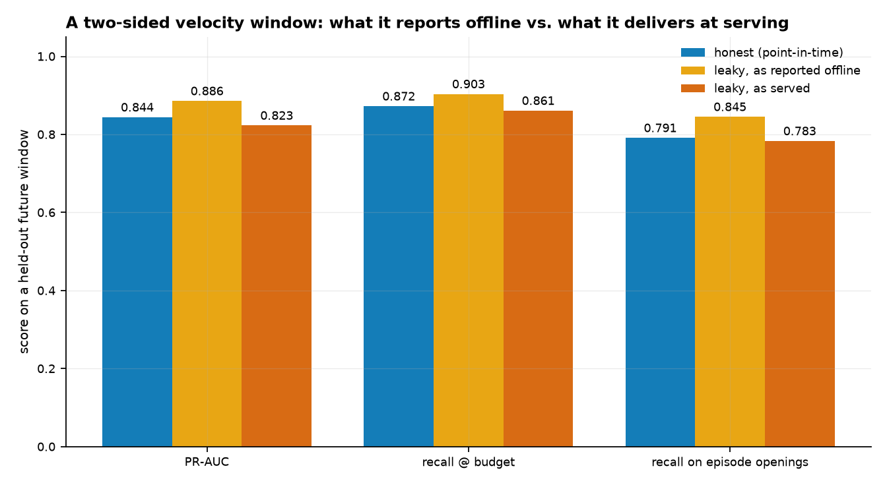
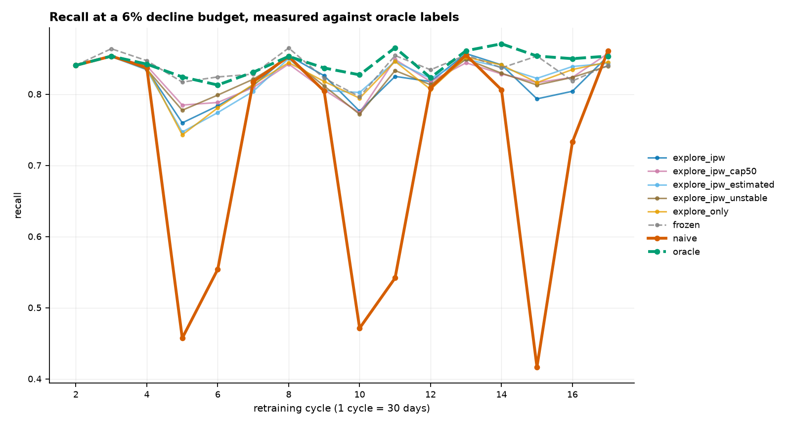
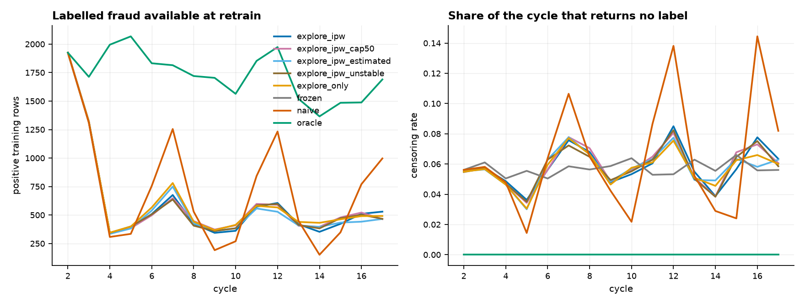
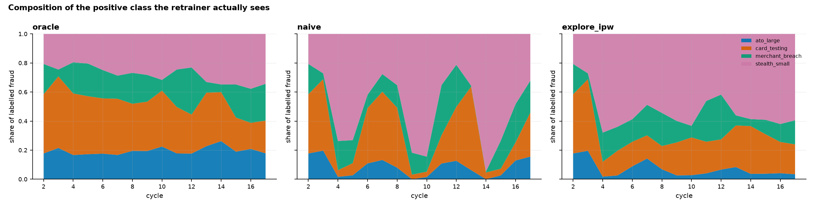
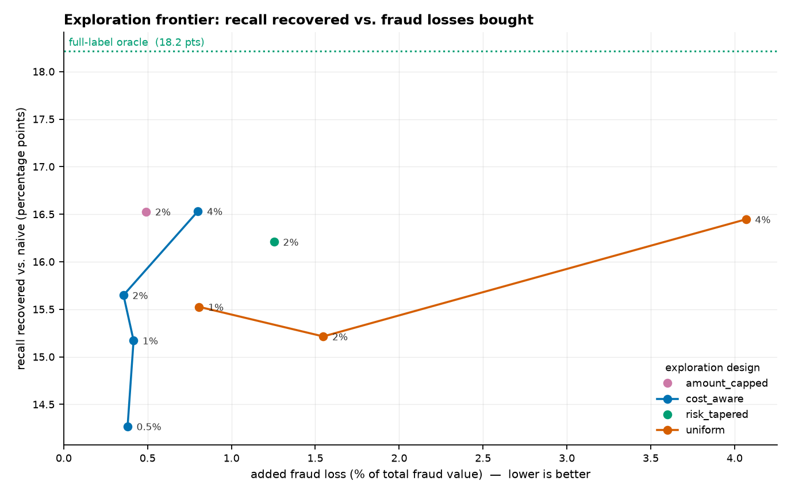

# Results

> Generated by `python experiments/run_all.py`. Every table and figure below is written by that script from `results/*.csv` -- nothing here is transcribed by hand, so a config change that moves a number moves it everywhere.

Configuration: `headline` — 18 cycles of 30 days, 6% decline budget, 3-cycle training window, 45-day label maturation.

## 1. Dataset calibration

The generated stream is calibrated against IEEE-CIS `train_transaction.csv`. Span is the one deliberate departure: the research question is about retraining cycles, so the stream is generated at 18 months natively rather than IEEE-CIS's ~182 days.

| statistic | ieee_cis | generated | ratio |
| --- | --- | --- | --- |
| n_transactions | 590540.0000 | 590540.0000 | 1.0000 |
| fraud_rate | 0.0350 | 0.0350 | 1.0003 |
| n_cards | 13553.0000 | 13553.0000 | 1.0000 |
| span_days | 181.8000 | 540.7767 | 2.9746 |
| amount_median | 68.7700 | 68.2100 | 0.9919 |
| amount_mean | 135.0300 | 152.1415 | 1.1267 |
| amount_p99 | 1200.0000 | 1370.0000 | 1.1417 |

## 2. What a two-sided velocity window manufactures

The leak that actually happens in fraud work is not target encoding, it is an unshifted `groupby().rolling()`: velocity aggregates over a window that includes transactions that had not happened yet. All three rows below score the same held-out future window; the second and third use the **same fitted model** and differ only in whether the features it is fed can see the future. The drop between them is the part of the offline number that was never real, and no amount of retraining recovers it.

| scenario | trained_on | scored_with | n | n_fraud | fraud_rate | roc_auc | pr_auc | recall_at_budget | precision_at_budget | value_recall_at_budget | recall_at_0.005 | recall_at_0.01 | recall_at_0.05 | opening_recall_at_budget |
| --- | --- | --- | --- | --- | --- | --- | --- | --- | --- | --- | --- | --- | --- | --- |
| honest (point-in-time) | point_in_time | point_in_time | 147635.0000 | 4507.0000 | 0.0305 | 0.9776 | 0.8440 | 0.8722 | 0.4438 | 0.9460 | 0.1637 | 0.3273 | 0.8485 | 0.7910 |
| leaky, as reported offline | two_sided_window | two_sided_window | 147635.0000 | 4507.0000 | 0.0305 | 0.9841 | 0.8856 | 0.9035 | 0.4597 | 0.9597 | 0.1637 | 0.3275 | 0.8857 | 0.8450 |
| leaky, as served | two_sided_window | point_in_time | 147635.0000 | 4507.0000 | 0.0305 | 0.9770 | 0.8229 | 0.8609 | 0.4380 | 0.9452 | 0.1637 | 0.3275 | 0.8365 | 0.7831 |

## 3. The closed loop

Recall at a 6% decline budget, measured against oracle labels on the **whole** cycle -- declined transactions included. No deployed system can compute this column, which is the entire reason the failure goes unnoticed in production: every metric an issuer *can* compute is restricted to approved traffic.

| arm | recall_at_budget_early | recall_at_budget_late | delta_rel | mean_over_run | p10_cycle | min_cycle | max_drawdown_rel | recovered_mean_pts | recovered_p10_pts | gap_closed | exploration_cost_share | mean_ess_ratio | total_cost |
| --- | --- | --- | --- | --- | --- | --- | --- | --- | --- | --- | --- | --- | --- |
| oracle | 0.8454 | 0.8523 | 0.0082 | 0.8436 | 0.8237 | 0.8129 | -0.0385 | 0.1242 | 0.3595 | 1.0000 | 0.0000 | 1.0000 | 456545.5232 |
| frozen | 0.8504 | 0.8375 | -0.0152 | 0.8373 | 0.8177 | 0.7965 | -0.0634 | 0.1179 | 0.3535 | 0.9493 | 0.0000 | — | 540332.0446 |
| explore_ipw_cap50 | 0.8446 | 0.8323 | -0.0145 | 0.8234 | 0.7865 | 0.7739 | -0.0837 | 0.1040 | 0.3223 | 0.8371 | 0.0049 | 0.2420 | 685989.4608 |
| explore_ipw_estimated | 0.8424 | 0.8348 | -0.0091 | 0.8231 | 0.7882 | 0.7468 | -0.1136 | 0.1037 | 0.3240 | 0.8346 | 0.0048 | 0.4319 | 784733.0058 |
| explore_only | 0.8438 | 0.8320 | -0.0140 | 0.8229 | 0.7875 | 0.7427 | -0.1197 | 0.1035 | 0.3233 | 0.8333 | 0.0049 | 1.0000 | 763031.6093 |
| explore_ipw_unstable | 0.8430 | 0.8253 | -0.0209 | 0.8226 | 0.7880 | 0.7717 | -0.0845 | 0.1032 | 0.3238 | 0.8306 | 0.0041 | 0.1412 | 672873.5004 |
| explore_ipw | 0.8430 | 0.8170 | -0.0308 | 0.8207 | 0.7798 | 0.7597 | -0.0988 | 0.1013 | 0.3156 | 0.8158 | 0.0043 | 0.1772 | 719957.8612 |
| naive | 0.8438 | 0.6701 | -0.2058 | 0.7194 | 0.4642 | 0.4166 | -0.5063 | 0.0000 | 0.0000 | 0.0000 | 0.0000 | 1.0000 | 1297779.0700 |

Recovery and gap-closed are measured on `mean_over_run` rather than on the final cycles. The closed loop sawtooths, so an end-of-run figure depends on where in the swing the run happens to stop; the run mean is also the business-relevant quantity, being proportional to fraud caught over the whole period.

- `naive` opens at **0.844** and closes at **0.670** (**-20.6%** over 18 cycles), averaging **0.719** with a worst cycle of **0.417**.
- `oracle`, which declines identically but keeps every label, averages **0.844** — a **0.124** gap attributable entirely to censoring, not to drift and not to the decision rule.
- `frozen`, which is never retrained at all, averages **0.837**, beating `naive` by **+0.118**. Under censored feedback, retraining is not a neutral act.
- `explore_ipw` recovers **+0.101** of mean recall (**82%** of the gap; **+0.316** in the bottom decile of cycles) for an added fraud loss of **0.43%** of fraud value.
- `explore_ipw_cap50` recovers **+0.104** of mean recall (**84%** of the gap; **+0.322** in the bottom decile of cycles) for an added fraud loss of **0.49%** of fraud value.
- `explore_only` recovers **+0.104** of mean recall (**83%** of the gap; **+0.323** in the bottom decile of cycles) for an added fraud loss of **0.49%** of fraud value.

### Why it happens: the supply of labelled fraud

The loop does not merely shrink the training set, it *selects* it. Positives survive into training only when the previous model failed to stop them, so the positive class drifts from "fraud" toward "fraud my predecessor missed".

## 4. The exploration frontier

Exploration is not free: every approved would-be decline is fraud risk bought on purpose. The question is what each design gets for the same money. Read the table horizontally: the designs recover similar amounts of recall and differ mostly in `exploration_cost_share`.

Note that `recovered_pts` and `gap_closed` here are measured on the final three cycles, not on the run mean as in §3 -- these arms are compared against each other on one consistent basis, so the two sections' `gap_closed` columns are not interchangeable.

| mode | rate | recall_late | recovered_pts | exploration_cost_share | explored_per_cycle | min_propensity | gap_closed | ess_ratio | runtime_s |
| --- | --- | --- | --- | --- | --- | --- | --- | --- | --- |
| cost_aware | 0.0050 | 0.8128 | 0.1427 | 0.0038 | 11.1250 | 0.0040 | 0.7832 | 0.1059 | 38.8184 |
| cost_aware | 0.0100 | 0.8218 | 0.1517 | 0.0042 | 20.0000 | 0.0040 | 0.8328 | 0.1240 | 38.6144 |
| cost_aware | 0.0200 | 0.8266 | 0.1565 | 0.0036 | 40.1875 | 0.0040 | 0.8590 | 0.1544 | 39.5218 |
| cost_aware | 0.0400 | 0.8354 | 0.1653 | 0.0080 | 78.9375 | 0.0040 | 0.9075 | 0.2162 | 39.5081 |
| uniform | 0.0100 | 0.8254 | 0.1553 | 0.0081 | 20.1875 | 0.0100 | 0.8522 | 0.1480 | 40.1096 |
| uniform | 0.0200 | 0.8222 | 0.1521 | 0.0155 | 42.6875 | 0.0200 | 0.8352 | 0.2043 | 39.5277 |
| uniform | 0.0400 | 0.8346 | 0.1645 | 0.0407 | 81.1250 | 0.0400 | 0.9028 | 0.3014 | 40.1131 |
| risk_tapered | 0.0200 | 0.8322 | 0.1621 | 0.0125 | 44.0000 | 0.0040 | 0.8898 | 0.1560 | 39.9395 |
| amount_capped | 0.0200 | 0.8354 | 0.1653 | 0.0049 | 44.1875 | 0.0040 | 0.9072 | 0.1905 | 39.2758 |

## 5. Off-policy evaluation against a knowable truth

Can a candidate policy be scored *before* shipping it, from logs the incumbent produced? Here the answer is checkable, because the simulator holds the counterfactual labels the estimators are trying to work around.

| estimator | estimate | truth | abs_error | rel_error | covers_truth | ess |
| --- | --- | --- | --- | --- | --- | --- |
| ips | 0.6300 | 0.9673 | 0.6232 | 0.6442 | 0.5556 | 4870.8609 |
| snips | 0.8836 | 0.9673 | 0.0906 | 0.0934 | 0.6667 | 4870.8609 |

## 6. Sensitivity

The headline decay is a property of a retraining configuration, not a constant. Shorter windows and larger decline budgets both deepen the damage, for the same reason: each removes more of the evidence the next model needs.

| train_window_cycles | decline_budget | naive_early | naive_late | decay_rel | naive_worst_cycle | oracle_late | explore_ipw_late | gap_closed |
| --- | --- | --- | --- | --- | --- | --- | --- | --- |
| 3.0000 | 0.0300 | 0.6742 | 0.5859 | -0.1311 | 0.5546 | 0.7264 | 0.7093 | 0.8777 |
| 3.0000 | 0.0600 | 0.8438 | 0.6701 | -0.2058 | 0.4166 | 0.8523 | 0.8170 | 0.8062 |
| 6.0000 | 0.0600 | 0.8489 | 0.7457 | -0.1215 | 0.6259 | 0.8706 | 0.8471 | 0.8119 |
| 12.0000 | 0.0600 | 0.8489 | 0.8295 | -0.0228 | 0.7849 | 0.8689 | 0.8560 | 0.6728 |

