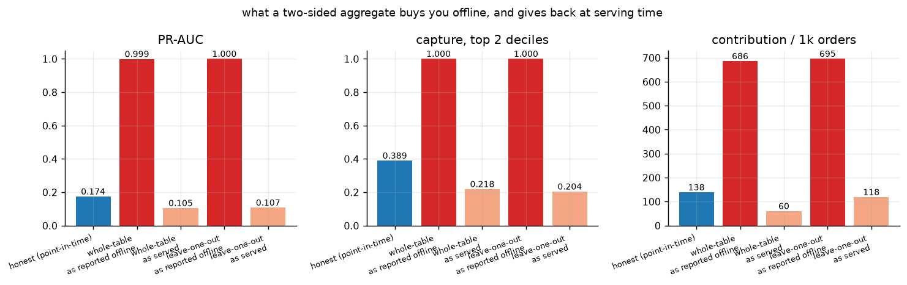
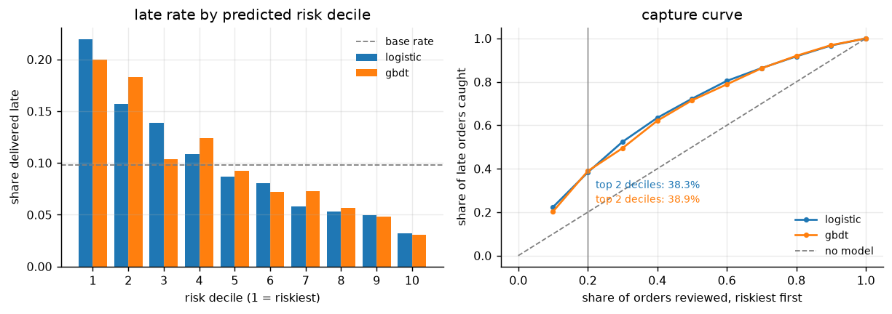
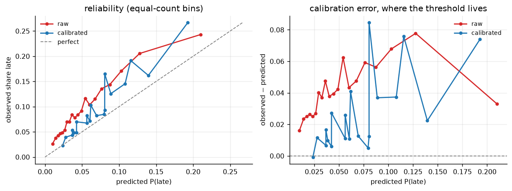
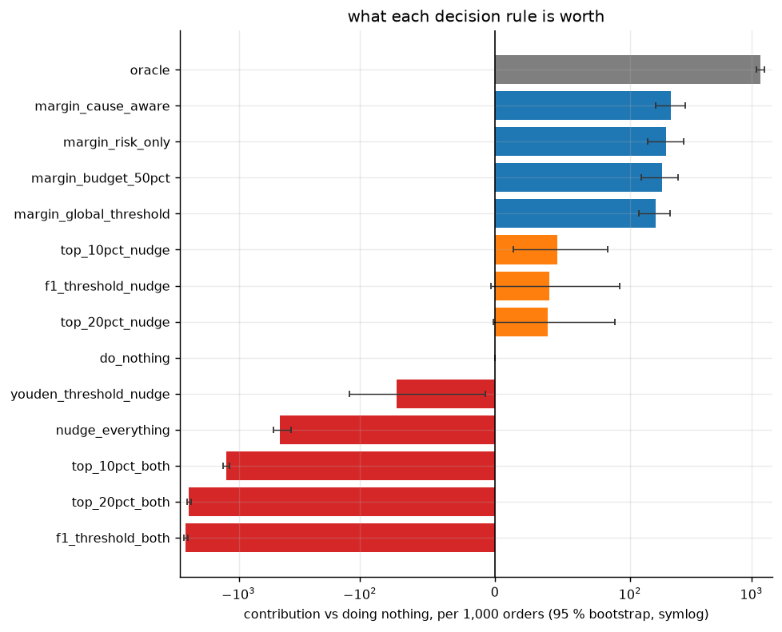
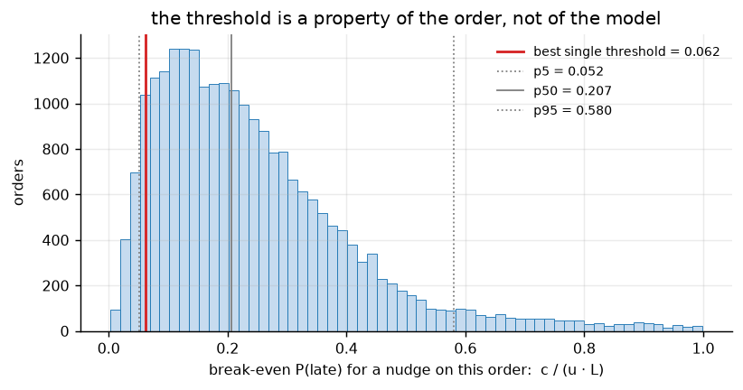
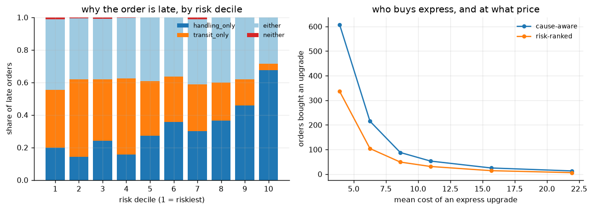
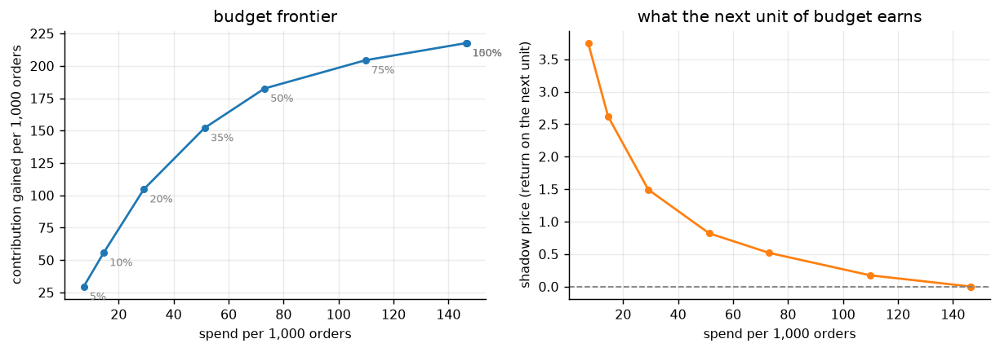
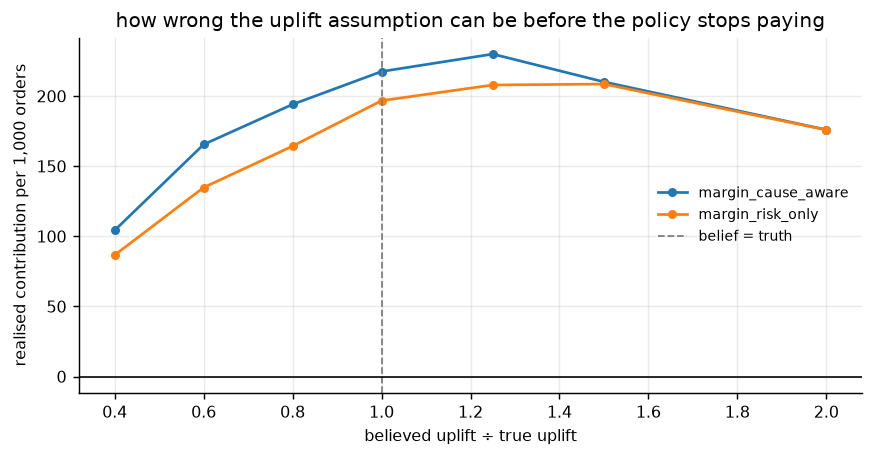

# Results

> Generated by `python experiments/run_all.py`. Every table and figure below is written by that
> script from `results/*.csv` — nothing here is transcribed by hand, so a config change that
> moves a number moves it everywhere.

Configuration: `headline` — 100K-order warehouse, point-in-time features over nine tables, calibrated risk and cause models, and every decision rule from a decile heuristic to a budget-constrained margin-optimised assignment.

Margin-optimised cause-aware assignment is worth **217** per 1,000 orders against doing nothing; the top-decile heuristic is worth **46**; the F1-optimal threshold is worth **-2728**.

## 1. Is the generated warehouse the right shape?

Marginals of the generated nine tables against the published Olist reference. `span_days` and
`mean_promise_days` are the deliberate departures — see `docs/METHODOLOGY.md` §2.

| statistic | reference | generated | ratio |
| --- | --- | --- | --- |
| items_per_order | 1.1330 | 1.1326 | 0.9997 |
| late_share_delivered | 0.0790 | 0.0790 | 1.0001 |
| mean_delivery_days | 12.1000 | 11.9260 | 0.9856 |
| mean_freight | 19.9900 | 20.5744 | 1.0292 |
| mean_payment_value | 154.1000 | 153.3256 | 0.9950 |
| mean_price | 120.6500 | 122.9946 | 1.0194 |
| mean_promise_days | 23.5000 | 21.3544 | 0.9087 |
| mean_review_score | 4.0900 | 4.1648 | 1.0183 |
| median_price | 74.9900 | 74.0200 | 0.9871 |
| n_customers_unique | 96096.0000 | 96096.0000 | 1.0000 |
| n_order_items | 112650.0000 | 112630.0000 | 0.9998 |
| n_orders | 99441.0000 | 99441.0000 | 1.0000 |
| n_products | 32951.0000 | 32951.0000 | 1.0000 |
| n_sellers | 3095.0000 | 3095.0000 | 1.0000 |
| span_days | — | 729.9060 | — |

## 2. What a two-sided aggregate manufactures

Every row scores the same held-out orders. Each "as served" row uses the **same fitted model** as
the "as reported offline" row above it, and differs only in whether the features it is fed can
see the future.

| scenario | trained_on | scored_with | pr_auc | capture_top2 | recall_at_10 | ece | calibration_slope | delta_per_1k | treated_share |
| --- | --- | --- | --- | --- | --- | --- | --- | --- | --- |
| honest (point-in-time) | point_in_time | point_in_time | 0.1740 | 0.3891 | 0.2031 | 0.0264 | 1.0268 | 138.3224 | 0.0787 |
| whole-table, as reported offline | two_sided | two_sided | 0.9987 | 1.0000 | 1.0000 | 0.0003 | 0.6198 | 685.7266 | 0.0761 |
| whole-table, as served | two_sided | point_in_time | 0.1046 | 0.2181 | 0.1191 | 0.0295 | 0.4191 | 60.0650 | 0.0288 |
| leave-one-out, as reported offline | two_sided_loo | two_sided_loo | 1.0000 | 1.0000 | 1.0000 | 0.0000 | 0.9983 | 695.2704 | 0.0756 |
| leave-one-out, as served | two_sided_loo | point_in_time | 0.1072 | 0.2035 | 0.1132 | 0.0308 | 0.2092 | 118.4881 | 0.0736 |

The leak is not spread evenly. It is largest exactly where an honest builder has nothing to work
with — a seller's first orders:

| scenario | bucket | n | roc_auc | pr_auc | capture_top2 |
| --- | --- | --- | --- | --- | --- |
| honest (point-in-time) | new seller (<5 prior) | 2240.0000 | 0.6647 | 0.1628 | 0.3410 |
| honest (point-in-time) | 5-49 prior | 14266.0000 | 0.6640 | 0.1716 | 0.3782 |
| honest (point-in-time) | 50+ prior | 7837.0000 | 0.6871 | 0.1900 | 0.4106 |
| whole-table, as reported offline | new seller (<5 prior) | 411.0000 | 1.0000 | 1.0000 | 1.0000 |
| whole-table, as reported offline | 5-49 prior | 14577.0000 | 0.9999 | 0.9986 | 1.0000 |
| whole-table, as reported offline | 50+ prior | 9355.0000 | 0.9999 | 0.9988 | 1.0000 |
| whole-table, as served | new seller (<5 prior) | 2240.0000 | 0.5189 | 0.1021 | 0.2304 |
| whole-table, as served | 5-49 prior | 14266.0000 | 0.5019 | 0.1023 | 0.1973 |
| whole-table, as served | 50+ prior | 7837.0000 | 0.5267 | 0.1105 | 0.2319 |
| leave-one-out, as reported offline | new seller (<5 prior) | 754.0000 | 1.0000 | 1.0000 | 1.0000 |
| leave-one-out, as reported offline | 5-49 prior | 14411.0000 | 1.0000 | 1.0000 | 1.0000 |
| leave-one-out, as reported offline | 50+ prior | 9178.0000 | 1.0000 | 1.0000 | 1.0000 |
| leave-one-out, as served | new seller (<5 prior) | 2240.0000 | 0.4938 | 0.0999 | 0.1797 |
| leave-one-out, as served | 5-49 prior | 14266.0000 | 0.5058 | 0.1106 | 0.2044 |
| leave-one-out, as served | 50+ prior | 7837.0000 | 0.5092 | 0.1047 | 0.2060 |

## 3. The risk models

| model | scores | roc_auc | pr_auc | capture_top1 | capture_top2 | capture_top3 | lift_top1 | brier | ece | mce | calibration_slope | mean_predicted | base_rate |
| --- | --- | --- | --- | --- | --- | --- | --- | --- | --- | --- | --- | --- | --- |
| logistic | raw | 0.6759 | 0.1930 | 0.2344 | 0.3878 | 0.5190 | 2.3446 | 0.0866 | 0.0301 | 0.1109 | 0.9048 | 0.1283 | 0.0983 |
| logistic | calibrated | 0.6750 | 0.1801 | 0.2236 | 0.3832 | 0.5240 | 2.2360 | 0.0855 | 0.0115 | 0.0372 | 0.9592 | 0.0989 | 0.0983 |
| gbdt | raw | 0.6718 | 0.1861 | 0.2282 | 0.3882 | 0.5157 | 2.2819 | 0.0873 | 0.0417 | 0.0777 | 0.7682 | 0.0566 | 0.0983 |
| gbdt | calibrated | 0.6700 | 0.1740 | 0.2031 | 0.3891 | 0.4948 | 2.0312 | 0.0864 | 0.0264 | 0.0846 | 1.0268 | 0.0720 | 0.0983 |

| model | decile | n | n_late | late_rate | lift | capture | cum_capture |
| --- | --- | --- | --- | --- | --- | --- | --- |
| logistic | 1 | 2434 | 535.0000 | 0.2198 | 2.2360 | 0.2236 | 0.2236 |
| logistic | 2 | 2434 | 382.0000 | 0.1569 | 1.5965 | 0.1596 | 0.3832 |
| logistic | 3 | 2434 | 337.0000 | 0.1385 | 1.4084 | 0.1408 | 0.5240 |
| logistic | 4 | 2435 | 264.0000 | 0.1084 | 1.1029 | 0.1103 | 0.6344 |
| logistic | 5 | 2434 | 211.0000 | 0.0867 | 0.8818 | 0.0882 | 0.7225 |
| logistic | 6 | 2434 | 196.0000 | 0.0805 | 0.8192 | 0.0819 | 0.8044 |
| logistic | 7 | 2435 | 141.0000 | 0.0579 | 0.5890 | 0.0589 | 0.8634 |
| logistic | 8 | 2434 | 129.0000 | 0.0530 | 0.5391 | 0.0539 | 0.9173 |
| logistic | 9 | 2434 | 120.0000 | 0.0493 | 0.5015 | 0.0501 | 0.9674 |
| logistic | 10 | 2435 | 78.0000 | 0.0320 | 0.3259 | 0.0326 | 1.0000 |
| gbdt | 1 | 2434 | 486.0000 | 0.1997 | 2.0312 | 0.2031 | 0.2031 |
| gbdt | 2 | 2434 | 445.0000 | 0.1828 | 1.8598 | 0.1860 | 0.3891 |
| gbdt | 3 | 2434 | 253.0000 | 0.1039 | 1.0574 | 0.1057 | 0.4948 |
| gbdt | 4 | 2435 | 302.0000 | 0.1240 | 1.2617 | 0.1262 | 0.6210 |
| gbdt | 5 | 2434 | 225.0000 | 0.0924 | 0.9404 | 0.0940 | 0.7150 |
| gbdt | 6 | 2434 | 176.0000 | 0.0723 | 0.7356 | 0.0735 | 0.7885 |
| gbdt | 7 | 2435 | 177.0000 | 0.0727 | 0.7394 | 0.0740 | 0.8625 |
| gbdt | 8 | 2434 | 137.0000 | 0.0563 | 0.5726 | 0.0573 | 0.9198 |
| gbdt | 9 | 2434 | 118.0000 | 0.0485 | 0.4932 | 0.0493 | 0.9691 |
| gbdt | 10 | 2435 | 74.0000 | 0.0304 | 0.3091 | 0.0309 | 1.0000 |

## 4. Calibration, and why the threshold cares

## 5. What each decision rule is worth

Realised contribution against the counterfactual truth, per 1,000 orders, with a 95 % bootstrap
interval over orders.

| model | scores | policy | treated_share | spend_per_1k | late_rate | late_rate_change_pct | contribution_per_1k | delta_per_1k | delta_lo | delta_hi | roi | n_nudge | n_expedite | n_both |
| --- | --- | --- | --- | --- | --- | --- | --- | --- | --- | --- | --- | --- | --- | --- |
| logistic | calibrated | oracle | 0.05 | 405.54 | 0.04 | -54.24 | 40366.80 | 1176.69 | 1093.45 | 1277.55 | 3.90 | 694 | 504 | 100 |
| logistic | calibrated | margin_cause_aware | 0.17 | 238.04 | 0.09 | -9.11 | 39403.13 | 213.02 | 148.37 | 297.99 | 1.89 | 4163 | 15 | 38 |
| logistic | calibrated | margin_budget_50pct | 0.09 | 118.92 | 0.09 | -5.14 | 39388.78 | 198.67 | 142.42 | 268.21 | 2.67 | 2149 | 2 | 18 |
| logistic | calibrated | margin_risk_only | 0.17 | 211.85 | 0.09 | -7.65 | 39385.34 | 195.23 | 139.75 | 272.84 | 1.92 | 4001 | 0 | 21 |
| logistic | calibrated | margin_global_threshold | 0.14 | 200.67 | 0.09 | -8.15 | 39369.30 | 179.19 | 123.69 | 257.92 | 1.89 | 3405 | 15 | 38 |
| logistic | calibrated | top_20pct_nudge | 0.20 | 240.02 | 0.09 | -9.61 | 39214.08 | 23.97 | -19.08 | 80.87 | 1.10 | 4869 | 0 | 0 |
| logistic | calibrated | top_10pct_nudge | 0.10 | 119.99 | 0.09 | -5.47 | 39212.19 | 22.08 | -5.01 | 55.68 | 1.18 | 2434 | 0 | 0 |
| logistic | calibrated | do_nothing | 0.00 | 0.00 | 0.10 | 0.00 | 39190.11 | 0.00 | 0.00 | 0.00 | — | 0 | 0 | 0 |
| logistic | calibrated | f1_threshold_nudge | 0.40 | 484.57 | 0.08 | -17.34 | 39152.01 | -38.10 | -85.28 | 24.95 | 0.92 | 9830 | 0 | 0 |
| logistic | calibrated | youden_threshold_nudge | 0.58 | 695.07 | 0.08 | -22.32 | 39066.33 | -123.77 | -175.25 | -43.46 | 0.82 | 14100 | 0 | 0 |
| logistic | calibrated | nudge_everything | 1.00 | 1200.00 | 0.07 | -29.00 | 38733.12 | -456.98 | -520.65 | -371.65 | 0.62 | 24343 | 0 | 0 |
| logistic | calibrated | top_10pct_both | 0.10 | 1711.02 | 0.08 | -16.34 | 37923.10 | -1267.01 | -1343.38 | -1196.17 | 0.26 | 0 | 0 | 2434 |
| logistic | calibrated | top_20pct_both | 0.20 | 3361.90 | 0.07 | -29.04 | 36599.70 | -2590.41 | -2689.47 | -2504.66 | 0.23 | 0 | 0 | 4869 |
| logistic | calibrated | f1_threshold_both | 0.40 | 6713.49 | 0.05 | -48.22 | 33698.87 | -5491.24 | -5612.29 | -5370.52 | 0.18 | 0 | 0 | 9830 |
| gbdt | calibrated | oracle | 0.05 | 405.54 | 0.04 | -54.24 | 40366.80 | 1176.69 | 1093.45 | 1277.55 | 3.90 | 694 | 504 | 100 |
| gbdt | calibrated | margin_cause_aware | 0.11 | 146.58 | 0.09 | -6.60 | 39407.60 | 217.49 | 161.84 | 284.99 | 2.48 | 2636 | 2 | 23 |
| gbdt | calibrated | margin_risk_only | 0.10 | 134.20 | 0.09 | -5.56 | 39386.81 | 196.70 | 139.78 | 274.33 | 2.47 | 2526 | 0 | 14 |
| gbdt | calibrated | margin_budget_50pct | 0.05 | 73.06 | 0.09 | -3.84 | 39372.62 | 182.51 | 124.32 | 249.96 | 3.50 | 1323 | 1 | 11 |
| gbdt | calibrated | margin_global_threshold | 0.10 | 131.31 | 0.09 | -5.98 | 39352.60 | 162.49 | 119.02 | 212.23 | 2.24 | 2340 | 2 | 22 |
| gbdt | calibrated | top_10pct_nudge | 0.10 | 119.99 | 0.09 | -5.81 | 39236.39 | 46.28 | 13.23 | 83.45 | 1.39 | 2434 | 0 | 0 |
| gbdt | calibrated | f1_threshold_nudge | 0.21 | 254.12 | 0.09 | -10.74 | 39230.56 | 40.45 | -3.10 | 92.44 | 1.16 | 5155 | 0 | 0 |
| gbdt | calibrated | top_20pct_nudge | 0.20 | 240.02 | 0.09 | -10.24 | 39228.98 | 38.87 | -1.32 | 88.88 | 1.16 | 4869 | 0 | 0 |
| gbdt | calibrated | do_nothing | 0.00 | 0.00 | 0.10 | 0.00 | 39190.11 | 0.00 | 0.00 | 0.00 | — | 0 | 0 | 0 |
| gbdt | calibrated | youden_threshold_nudge | 0.43 | 511.49 | 0.08 | -16.88 | 39117.26 | -72.85 | -122.41 | -7.40 | 0.86 | 10376 | 0 | 0 |
| gbdt | calibrated | nudge_everything | 1.00 | 1200.00 | 0.07 | -29.00 | 38733.12 | -456.98 | -520.65 | -371.65 | 0.62 | 24343 | 0 | 0 |
| gbdt | calibrated | top_10pct_both | 0.10 | 1706.18 | 0.08 | -15.34 | 37926.98 | -1263.13 | -1347.15 | -1184.06 | 0.26 | 0 | 0 | 2434 |
| gbdt | calibrated | top_20pct_both | 0.20 | 3367.88 | 0.07 | -29.80 | 36622.23 | -2567.88 | -2669.70 | -2474.76 | 0.24 | 0 | 0 | 4869 |
| gbdt | calibrated | f1_threshold_both | 0.21 | 3559.14 | 0.07 | -31.01 | 36462.46 | -2727.64 | -2828.75 | -2625.02 | 0.23 | 0 | 0 | 5155 |
| gbdt | raw | oracle | 0.05 | 405.54 | 0.04 | -54.24 | 40366.80 | 1176.69 | 1093.45 | 1277.55 | 3.90 | 694 | 504 | 100 |
| gbdt | raw | margin_cause_aware | 0.08 | 108.59 | 0.09 | -5.56 | 39393.14 | 203.03 | 146.65 | 272.54 | 2.87 | 1905 | 3 | 20 |
| gbdt | raw | margin_risk_only | 0.08 | 103.30 | 0.09 | -4.60 | 39343.09 | 152.98 | 101.03 | 217.11 | 2.48 | 1945 | 0 | 11 |
| gbdt | raw | margin_global_threshold | 0.07 | 103.21 | 0.09 | -5.14 | 39338.42 | 148.31 | 102.76 | 201.88 | 2.44 | 1796 | 3 | 20 |
| gbdt | raw | margin_budget_50pct | 0.04 | 54.27 | 0.10 | -2.84 | 39316.60 | 126.50 | 82.96 | 178.83 | 3.33 | 973 | 0 | 9 |
| gbdt | raw | top_10pct_nudge | 0.10 | 119.99 | 0.09 | -6.27 | 39244.57 | 54.46 | 20.14 | 90.59 | 1.45 | 2434 | 0 | 0 |
| gbdt | raw | top_20pct_nudge | 0.20 | 240.02 | 0.09 | -10.36 | 39230.84 | 40.73 | -0.01 | 90.69 | 1.17 | 4869 | 0 | 0 |
| gbdt | raw | f1_threshold_nudge | 0.20 | 242.98 | 0.09 | -10.41 | 39228.65 | 38.54 | -2.75 | 88.72 | 1.16 | 4929 | 0 | 0 |
| gbdt | raw | do_nothing | 0.00 | 0.00 | 0.10 | 0.00 | 39190.11 | 0.00 | 0.00 | 0.00 | — | 0 | 0 | 0 |
| gbdt | raw | youden_threshold_nudge | 0.43 | 510.45 | 0.08 | -16.88 | 39118.30 | -71.81 | -121.47 | -6.10 | 0.86 | 10355 | 0 | 0 |
| gbdt | raw | nudge_everything | 1.00 | 1200.00 | 0.07 | -29.00 | 38733.12 | -456.98 | -520.65 | -371.65 | 0.62 | 24343 | 0 | 0 |
| gbdt | raw | top_10pct_both | 0.10 | 1706.26 | 0.08 | -17.34 | 37976.53 | -1213.58 | -1293.69 | -1133.89 | 0.29 | 0 | 0 | 2434 |
| gbdt | raw | top_20pct_both | 0.20 | 3366.72 | 0.07 | -29.80 | 36619.84 | -2570.27 | -2669.27 | -2472.85 | 0.24 | 0 | 0 | 4869 |
| gbdt | raw | f1_threshold_both | 0.20 | 3407.01 | 0.07 | -30.09 | 36587.56 | -2602.55 | -2701.97 | -2503.75 | 0.24 | 0 | 0 | 4929 |

### The threshold is a property of the order

`c / (u · L)` — the break-even probability for a nudge — computed per order:

| quantile | break_even_p | best_single_threshold | ratio_to_single |
| --- | --- | --- | --- |
| 0.0500 | 0.0520 | 0.0618 | 0.8412 |
| 0.2500 | 0.1207 | 0.0618 | 1.9522 |
| 0.5000 | 0.2066 | 0.0618 | 3.3425 |
| 0.7500 | 0.3201 | 0.0618 | 5.1783 |
| 0.9500 | 0.5798 | 0.0618 | 9.3776 |

## 6. Knowing *why* an order is at risk

| decile | either | handling_only | neither | transit_only |
| --- | --- | --- | --- | --- |
| 1.0000 | 0.4342 | 0.1996 | 0.0103 | 0.3560 |
| 2.0000 | 0.3730 | 0.1416 | 0.0067 | 0.4787 |
| 3.0000 | 0.3715 | 0.2411 | 0.0079 | 0.3794 |
| 4.0000 | 0.3709 | 0.1556 | 0.0033 | 0.4702 |
| 5.0000 | 0.3911 | 0.2711 | 0.0000 | 0.3378 |
| 6.0000 | 0.3636 | 0.3580 | 0.0000 | 0.2784 |
| 7.0000 | 0.4011 | 0.2994 | 0.0113 | 0.2881 |
| 8.0000 | 0.4015 | 0.3650 | 0.0000 | 0.2336 |
| 9.0000 | 0.3814 | 0.4576 | 0.0000 | 0.1610 |
| 10.0000 | 0.2838 | 0.6757 | 0.0000 | 0.0405 |

At equal spend, cause-aware assignment against risk-ranked assignment:

| budget_share | cause_aware | risk_only | uplift_pct |
| --- | --- | --- | --- |
| 0.05 | 29.55 | 19.02 | 55.35 |
| 0.10 | 55.70 | 55.33 | 0.66 |
| 0.20 | 104.74 | 93.52 | 12.00 |
| 0.35 | 152.07 | 117.57 | 29.35 |
| 0.50 | 182.51 | 147.99 | 23.33 |
| 0.75 | 204.35 | 177.58 | 15.07 |
| 1.00 | 217.59 | 196.70 | 10.62 |
| 1.50 | 217.49 | 196.70 | 10.57 |

| action | risk_only | cause_aware |
| --- | --- | --- |
| none | 21803 | 21682 |
| nudge | 2526 | 2636 |
| expedite | 0 | 2 |
| both | 14 | 23 |

### The express upgrade is a price, not a model output

| expedite_multiplier | mean_expedite_cost | policy | treated_share | spend_per_1k | n_nudge | n_expedite | n_both | delta_per_1k | roi |
| --- | --- | --- | --- | --- | --- | --- | --- | --- | --- |
| 0.25 | 3.92 | margin_cause_aware | 0.12 | 206.17 | 2270 | 452 | 155 | 334.20 | 2.62 |
| 0.25 | 3.92 | margin_risk_only | 0.10 | 175.93 | 2204 | 0 | 336 | 267.89 | 2.52 |
| 0.40 | 6.27 | margin_cause_aware | 0.11 | 176.57 | 2502 | 131 | 84 | 262.11 | 2.48 |
| 0.40 | 6.27 | margin_risk_only | 0.10 | 150.27 | 2436 | 0 | 104 | 216.07 | 2.44 |
| 0.55 | 8.62 | margin_cause_aware | 0.11 | 158.14 | 2590 | 40 | 48 | 245.04 | 2.55 |
| 0.55 | 8.62 | margin_risk_only | 0.10 | 142.21 | 2491 | 0 | 49 | 191.72 | 2.35 |
| 0.70 | 10.97 | margin_cause_aware | 0.11 | 152.70 | 2613 | 16 | 37 | 228.27 | 2.49 |
| 0.70 | 10.97 | margin_risk_only | 0.10 | 139.32 | 2509 | 0 | 31 | 191.58 | 2.38 |
| 1.00 | 15.68 | margin_cause_aware | 0.11 | 146.58 | 2636 | 2 | 23 | 217.49 | 2.48 |
| 1.00 | 15.68 | margin_risk_only | 0.10 | 134.20 | 2526 | 0 | 14 | 196.70 | 2.47 |
| 1.40 | 21.95 | margin_cause_aware | 0.11 | 142.24 | 2647 | 0 | 13 | 213.57 | 2.50 |
| 1.40 | 21.95 | margin_risk_only | 0.10 | 130.45 | 2534 | 0 | 6 | 189.51 | 2.45 |

## 7. Budget

| budget_share | treated_share | spend_per_1k | late_rate | delta_per_1k | delta_lo | delta_hi | roi | shadow_price |
| --- | --- | --- | --- | --- | --- | --- | --- | --- |
| 0.050 | 0.006 | 7.296 | 0.098 | 29.549 | 9.224 | 54.620 | 5.050 | 3.748 |
| 0.100 | 0.012 | 14.569 | 0.098 | 55.699 | 25.736 | 90.874 | 4.823 | 2.617 |
| 0.200 | 0.022 | 29.174 | 0.097 | 104.740 | 62.397 | 151.039 | 4.590 | 1.492 |
| 0.350 | 0.040 | 51.296 | 0.096 | 152.070 | 102.505 | 221.325 | 3.965 | 0.820 |
| 0.500 | 0.055 | 73.065 | 0.095 | 182.511 | 124.324 | 249.964 | 3.498 | 0.520 |
| 0.750 | 0.084 | 109.813 | 0.093 | 204.347 | 151.700 | 271.287 | 2.861 | 0.174 |
| 1.000 | 0.109 | 146.482 | 0.092 | 217.590 | 161.940 | 285.038 | 2.485 | 0.000 |
| 1.500 | 0.109 | 146.581 | 0.092 | 217.491 | 161.841 | 284.988 | 2.484 | 0.000 |

## 8. How wrong can the uplift belief be?

The physics are fixed; only the belief moves.

| policy | believed_rho_scale | rho_nudge | rho_expedite | treated_share | spend_per_1k | delta_per_1k | roi |
| --- | --- | --- | --- | --- | --- | --- | --- |
| margin_cause_aware | 0.400 | 0.184 | 0.284 | 0.022 | 29.655 | 104.259 | 4.516 |
| margin_risk_only | 0.400 | 0.184 | 0.284 | 0.022 | 28.133 | 86.619 | 4.079 |
| margin_cause_aware | 0.600 | 0.276 | 0.426 | 0.047 | 63.726 | 165.474 | 3.597 |
| margin_risk_only | 0.600 | 0.276 | 0.426 | 0.044 | 56.491 | 134.771 | 3.386 |
| margin_cause_aware | 0.800 | 0.368 | 0.568 | 0.076 | 99.707 | 194.062 | 2.946 |
| margin_risk_only | 0.800 | 0.368 | 0.568 | 0.074 | 93.937 | 164.288 | 2.749 |
| margin_cause_aware | 1.000 | 0.460 | 0.710 | 0.109 | 146.581 | 217.491 | 2.484 |
| margin_risk_only | 1.000 | 0.460 | 0.710 | 0.104 | 134.195 | 196.705 | 2.466 |
| margin_cause_aware | 1.250 | 0.575 | 0.887 | 0.152 | 204.570 | 229.939 | 2.124 |
| margin_risk_only | 1.250 | 0.575 | 0.887 | 0.149 | 191.763 | 207.885 | 2.084 |
| margin_cause_aware | 1.500 | 0.690 | 1.065 | 0.196 | 264.917 | 210.094 | 1.793 |
| margin_risk_only | 1.500 | 0.690 | 1.065 | 0.192 | 244.016 | 208.546 | 1.855 |
| margin_cause_aware | 2.000 | 0.920 | 1.420 | 0.281 | 384.606 | 175.947 | 1.457 |
| margin_risk_only | 2.000 | 0.920 | 1.420 | 0.278 | 348.055 | 175.853 | 1.505 |

